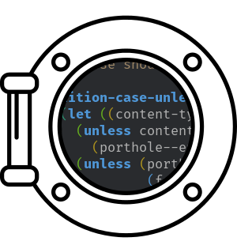

<p align=center>
    
</p>

<h1 align=center>Porthole</h1>

<p align=center>RPC servers for Emacs.</p>

<p align=center>
<!-- This is an emoticon. Don't delete it if it doesn't show up in your editor. -->
<!-- 📡 -->
 :ship:
</p>

---

<!-- ## What is this Package? -->

Porthole lets you start RPC servers in Emacs. These servers allow Elisp to be
invoked remotely via HTTP requests.

You can expose data that exists within Emacs, or control Emacs from an external
program. Perhaps you want to leverage Emacs' excellent editing facilities? It's
up to you.

---

<!-- markdown-toc start - Don't edit this section. Run M-x markdown-toc-refresh-toc

    Please note that the markdown generator doesn't work perfectly with a
    centered heading, as above. It will need manual tweaking -->

**Table of Contents**

- [Typical Workflow](#typical-workflow)
    - [Multiple Servers](#multiple-servers)
    - [I Want More Control](#i-want-more-control)
- [Why?](#why)
- [Usage Examples](#usage-examples)
    - [Example 1: Quickstart with the Python Client](#example-1-quickstart-with-the-python-client)
    - [Example 2: POSTing RPC Calls Directly](#example-2-posting-rpc-calls-directly)
    - [Example 3: Manual Setup](#example-3-manual-setup)
- [The JSON-RPC 2.0 Protocol](#the-json-rpc-20-protocol)
- [Symbols & Keyword Arguments](#symbols--keyword-arguments)
- [Writing a Client](#writing-a-client)
- [What About Security?](#what-about-security)
    - [Outside Localhost](#outside-localhost)
- [Installation](#installation)
- [FAQ](#faq)

<!-- markdown-toc end -->


## Typical Workflow

Porthole servers are designed to "just work." All your server needs is a name
and clients will be able to find it automatically. Here's a typical workflow:

**In Emacs**

1. Pick a name and start your server.
2. Tell it which functions you want to be available to RPC calls.

Now, continue using Emacs.

**In the Client**

1. Load the connection information from your server's session file (this file
   has a known path).
2. POST a JSON-RPC request to the server.

   _\*Emacs executes your RPC call and returns the result.\*_

3. Parse the JSON-RPC 2.0 object you received.

That's it! There's even a [Python Client](https://github.com/jcaw/porthole-python-client) to handle the client-side automatically. See [Example 1](#example-1-quickstart-with-the-python-client) for a demonstration.

### Multiple Servers

Many Porthole servers can run at once - they won't interfere with one another,
except that Emacs can only process one request at a time. Your package can start
a Porthole server without worrying about other packages.

### I Want More Control

You can have it! Take a look at the [manual setup](#example-3-manual-setup)
example.

## Why?

I want to open Emacs up. An Emacs session has a lot happening, and it's all
text. What if you could gain access to that information?

What if you could:

- Edit the contents of any text box [with Emacs?](https://github.com/cknadler/vim-anywhere)
- Interact with Emacs from a Python REPL?
- Control Emacs with something other than a keyboard, like [your voice?](https://www.youtube.com/watch?v=8SkdfdXWYaI)
- Use Emacs' outstanding editing tools *outside Emacs?*

All of these need some way of communicating with Emacs. Porthole acts as a
foundation that allows Emacs to expose its functionality to other languages, in
a way that's simple.

## Usage Examples

Let's run through some usage examples.

### Example 1: Quickstart with the Python Client

By default, each server just requires a name. Clients can connect automatically, as long
as they know the name.

Let's say you want to write a Python package, `pyrate-ship`, that allows you to
use Emacs as a calculator.

<b>In Emacs:</b>

Starting a server is easy. All you need is a name:

```emacs-lisp
;; Start a Porthole RPC server.
(porthole-start-server "pyrate-server")
;; Functions have to be exposed before they can be invoked remotely.
;; Let's expose the `+' function.
(porthole-expose-function "pyrate-server" '+)
```

<b>In the Client:</b>

The easiest way to send RPC calls to Porthole is with the [Porthole Python
Client](https://github.com/jcaw/porthole-python-client). For now, let's use
that. In the next example, we'll send a request manually. This is a minimal
example:

```python
import emacs_porthole

# Calling from Python is easy - you only need one line.
result = emacs_porthole.call("pyrate-server", method="+", params=[1, 2, 3])
# If successful, Porthole will return the result.
assert result == 6
```

If the call fails, the Porthole Python Client will raise a relevant error. Here's what
it looks like with error handling:

```python
from emacs_porthole import call, PortholeConnectionError, JsonRpcError

def sum_in_emacs():
    try:
        return call("pyrate-server", method="+", [1, 2, 3])
    except PortholeConnectionError:
        # This happens when a connection to the server could not be made successfully.
        print("Could not connect to the server.")
    except JsonRpcError as e:
        # This happens when a JSON-RPC response was returned, and it indicated
        # an error. This normally means Emacs encountered an error executing
        # the function.
        print("A JSON-RPC Error was returned. Details:", e.json_rpc_error)
```

### Example 2: POSTing RPC Calls Directly

It's easy to send RPC calls to Porthole servers yourself. Just POST some JSON.
Here's the basic process:

1. Read the server's port from the [session file](#session-information) (this
will have a known path).
2. Send a POST request to `localhost:<port>` with the JSON-RPC 2.0 request
encoded in the body.

We'll write a client that works on Linux, in Python, using `requests` for our
HTTP calls.

**In Emacs**

Start your server, like in the last example:

```emacs-lisp
;; Start an automatic server.
(porthole-start-server "pryvateer-server")
;; This time, we'll expose the `insert' function.
(porthole-expose-function "pryvateer-server" 'insert)
```

```python
import requests
import json

def pryvateer_insert():
    server_name = "pryvateer-server"

    # Preparing a call is easy.
    rpc_call = {
        "jsonrpc": "2.0",
        "method": "insert",
        "params": ["This is some text we want to insert"],
        "id": 23084
    }

    # The session info is always stored in the same basic path. The `temp_dir`
    # varies by platform - we'll explain how to manage that later.
    temp_dir = os.environ.get("HOME")
    session_info_path = "{temp_dir}/emacs-porthole/{server_name}/session.json".format(
        temp_dir=temp_dir,
        server_name=server_name
    )

    # Now, we load the server information from the file.
    if os.path.isfile(session_info_path):
        session_info = json.read(open(session_info_path))
    else:
        raise RuntimeError("Server does not appear to be running.")

    # Finally, we can post our request to the server.
    address = "http://localhost:{}".format(session_info["port"])
    auth = requests.HTTPBasicAuth(session_info["username"],session_info["password"])
    response = requests.post(address, json=rpc_call, auth=auth)
    if response.status_code == 200:
        # If the call is successful, the body will be a JSON-RPC 2.0 response.
        # Decode it into Python, and return it.
        return response.json()
    else:
        raise RuntimeError("Response code {} received.".format(response.status_code))
```

This client isn't perfect - it doesn't cover every edge case. See the source
code for the [Porthole Python
client](https://github.com/jcaw/porthole-python-client) if you'd like to write a
thorough client in another language.

### Example 3: Manual Setup

Automatic servers are the intended use case of Porthole. However, you may wish
to configure the server manually. Here's an example:

<b>In Emacs:</b>

Start a server on a specific port, with a specific username and password:

```emacs-lisp
;; Start a server on port 8000 with basic authentication.
;; Don't publish any information about the server.
(porthole-start-server
 "spanish-navy-server"
 :PORT 8000
 :USERNAME "my_username"
 :PASSWORD "my_password"
 :PUBLISH-PORT nil
 :PUBLISH-USERNAME nil
 :PUBLISH-PASSWORD nil
 )
;; Remember, functions have to be exposed before they can be invoked remotely.
(porthole-expose-function "spanish-navy-server" 'revert-buffer)
```

<b>In the Client:</b>

Send a POST request to port 8000 with the JSON-RPC 2.0 request encoded in the
body. Put the Basic Authentication credentials in the header.

In Python:

```python
import requests

rpc_call = {
    "jsonrpc": "2.0"
    "method": "insert",
    # Note how keyword arguments are supplied. See the `json-rpc-server.el`
    # package for more information.
    "params": [":ignore-auto" ":noconfirm"],
    "id": 23084
}
# This is just an example. In production, you would need much more error
# checking.
response = requests.post("http://localhost:8000",
                         json=rpc_call,
                         auth=("my_username", "my_password"))
print(response.json())
```

See the [`json-rpc-server` package](https://github.com/jcaw/json-rpc-server.el)
for more information.

## The JSON-RPC 2.0 Protocol

This server uses JSON-RPC 2.0 as the underlying protocol for executing
functions. This is handled by the `json-rpc-server` package. For instructions on
how to structure JSON-RPC requests for Emacs, see that package's
[README](https://github.com/jcaw/json-rpc-server.el) directly.

## Symbols & Keyword Arguments

The JSON-RPC 2.0 only allows you to send certain datatypes. Porthole modifies
this syntax to allow you to send Elisp symbols. You should send them as strings,
but tag them like you would in Elisp code, e.g. `"'symbol"` or
`"'another-symbol"`. Keyword arguments can be sent similarly: `":keyword"`, `":another-keyword"`

In addition, because Elisp arguments are always positional (even keyword
arguments are actually sent as a list), the standard JSON-RPC 2.0 method for
sending keyword arguments is not supported. Arguments must always be sent as
lists, just like in Elisp.

Here's an example:

```python
from emacs_porhole import call

call("steamboat-server",
     method="a-cl-function",
     params=["positional-arg", "'positional-symbol",
             ":keyword-1", "value-1",
             ":another-keyword", "'symbol-value"])
```

In raw JSON:

```jsonrpc
{
  "jsonrpc": "2.0",
  "method": "a-cl-function",
  "params": [
    "positional-arg", "'positional-symbol", ":keyword-1", "value-1",
    ":another-keyword", "'symbol-value"
  ]

}
```

This is just an overview. See the
[json-rpc-server](http://github.com/jcaw/json-rpc-server) for a detailed
explanation of how the JSON-RPC part works.


## Writing a Client

Servers store their session information on a predictable file path, available
only to the current user - that's how clients are able to connect automatically.
The session file will be a `session.json` file with the following format:

```json
{
  "port": 38790,
  "username": "9ce7abca51f93adca8e7239c91db41f5be0f925efddffddd51bdbae66bc03fb6",
  "password": "506c06f36d48f950b975783dba4c1bd9563d1c5aac30c7c86214d8804e4d3c9a"
}
```

The client should read from this file when it wants to connect. The file path
will be predictable:

```python
"{temp_dir}/emacs-porthole/{server_name}/session.json"
```

`{server-name}` is the name of the server. `{temp_dir}` represents a user-only
temporary directory and it will be different depending on the platform. Here is
how it's derived:

**Windows**

`temp_dir` is set to `%temp%`. The full path is:

```emacs-lisp
;; This is the path on Windows
"%temp%/emacs-porthole/{server_name}/session.json"
```

**Mac OS**

`temp_dir` is set to `$HOME/Library`. The full path is:

```emacs-lisp
;; This is the path on Mac
"$HOME/Library/emacs-porthole/{server_name}/session.json"
```

**Linux**

Linux is less predictable, so two methods are used.

`temp_dir` is set to the `$XDG_RUNTIME_DIR` environment variable if it exists.
Normally, it will. If it does not, it is set to `$HOME/tmp`.

Thus, the full path is:

```pseudocode
# This is the path on Linux
if exists("$XDG_RUNTIME_DIR"):
    "$XDG_RUNTIME_DIR/emacs-porthole/{server_name}/session.json"
else:
    "$HOME/tmp/emacs-porthole/{server_name}/session.json"
```

If neither `$XDG_RUNTIME_DIR` or `$HOME` exist, no session file is created.

**Unknown Systems**

Porthole will make an effort to run on unknown systems. If the system is
unknown, it will use the same method as Linux.


## What About Security?

By default, servers run on private ports. They are only available to localhost.
Because of how Emacs handles TCP connections, the port will be visible to all
local users, but login credentials are only available to the current user.

### Outside Localhost

If you want to expose your server on a public port, be careful.

None of the existing Emacs HTTP servers support HTTPS. The most secure form of
authentication offered by any is Basic Authentication. In other words, login
credentials have to be sent over the network in plain text. You <b>should not
allow direct connections to the server from outside localhost.</b>

If you _would_ like to publish the server over a wider network, the recommended
way is to use an HTTPS proxy, such as [Apache](https://httpd.apache.org/) or
[Nginx](https://www.nginx.com/). The proxy can forward external requests to the
local RPC server. The `emacs-web-server` manual has a [longer
explanation](http://eschulte.github.io/emacs-web-server/tutorials/#sec-3) with
instructions.

## Installation

It will be installable from MELPA once I persuade them to add it (and the underlying
[`json-rpc-server`](http://github.com/jcaw/json-rpc-server.el)).

## List of Clients

| Language | Link                                                                     |
| ---      | ---                                                                      |
| Python   | [porthole-python-client](https://github.com/jcaw/porthole-python-client) |

Do you have a client? Make a pull request to add it to the list!

## FAQ

- <b>Can I run multiple servers?</b> Yes. Porthole is designed to allow packages
  to build their own RPC system, without worrying about other packages.
- <b>Is there support planned for other protocols than JSON-RPC?</b> Yes, but
  probably not for a while
- <b>Do you accept pull requests?</b> Yes! If you like, you can open an issue
  first to discuss ideas.
